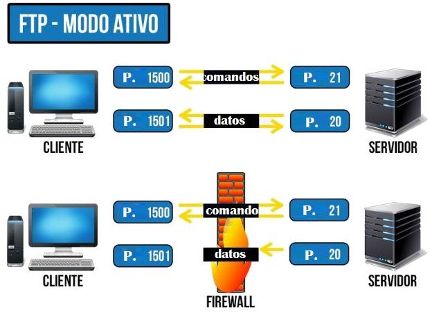

# Despliegue de Aplicaciones Web - 05 - Servicios de Almacenamiento de Archivos

Tema 05. Servicios de Almacenamiento de Archivos. 2DAW. Curso 2025/2026.


- [Despliegue de Aplicaciones Web - 05 - Servicios de Almacenamiento de Archivos](#despliegue-de-aplicaciones-web---05---servicios-de-almacenamiento-de-archivos)
- [Contenido en Youtube](#contenido-en-youtube)
- [FTP](#ftp)
  - [Puertos de Control y de Datos](#puertos-de-control-y-de-datos)
    - [Asignación de Puertos](#asignación-de-puertos)
  - [1. FTP Modo Activo (El Predeterminado)](#1-ftp-modo-activo-el-predeterminado)
    - [Secuencia de Conexión](#secuencia-de-conexión)
    - [El Principal Inconveniente: El Firewall del Cliente](#el-principal-inconveniente-el-firewall-del-cliente)
  - [2. FTP Modo Pasivo (La Solución)](#2-ftp-modo-pasivo-la-solución)
    - [Secuencia de Conexión](#secuencia-de-conexión-1)
    - [La Ventaja: El Firewall del Cliente no Bloquea](#la-ventaja-el-firewall-del-cliente-no-bloquea)
    - [El Principal Inconveniente: Seguridad del Servidor](#el-principal-inconveniente-seguridad-del-servidor)
  - [Resumen y Problemas Frecuentes](#resumen-y-problemas-frecuentes)
    - [Conclusiones](#conclusiones)
  - [Comandos FTP](#comandos-ftp)
    - [Códigos de Respuesta FTP](#códigos-de-respuesta-ftp)
    - [Ejemplo de uso de FTP](#ejemplo-de-uso-de-ftp)
- [Servidor VSFTPD](#servidor-vsftpd)
  - [VSFTPD con Docker](#vsftpd-con-docker)
  - [Configuración de un servidor FTP con Docker Compose](#configuración-de-un-servidor-ftp-con-docker-compose)
  - [Añadiendo más usuarios](#añadiendo-más-usuarios)
  - [¿Cómo hacer la jaula al usuario?](#cómo-hacer-la-jaula-al-usuario)
    - [El concepto: `chroot_local_user`](#el-concepto-chroot_local_user)
    - [Paso 1: Crear el archivo de configuración personalizado](#paso-1-crear-el-archivo-de-configuración-personalizado)
    - [Paso 2: Modificar el Docker Compose](#paso-2-modificar-el-docker-compose)
    - [Paso 3: Entender la estructura de carpetas resultante](#paso-3-entender-la-estructura-de-carpetas-resultante)
    - [¿Cómo verifico que funciona?](#cómo-verifico-que-funciona)
    - [Resumen de seguridad](#resumen-de-seguridad)
  - [Configuración de FTPS (FTP seguro con SSL/TLS)](#configuración-de-ftps-ftp-seguro-con-ssltls)
    - [1. Generación de certificados con OpenSSL](#1-generación-de-certificados-con-openssl)
    - [2. Archivo de configuración (vsftpd.conf)](#2-archivo-de-configuración-vsftpdconf)
    - [3. Docker Compose para FTPS](#3-docker-compose-para-ftps)
    - [Cómo conectarse con FileZilla u otro cliente](#cómo-conectarse-con-filezilla-u-otro-cliente)
- [Servidor SFTP Seguro con OpenSSH](#servidor-sftp-seguro-con-openssh)
  - [1. Preparación del entorno](#1-preparación-del-entorno)
  - [2. Generación de Claves SSH (Adiós contraseñas)](#2-generación-de-claves-ssh-adiós-contraseñas)
  - [3. El archivo Docker Compose](#3-el-archivo-docker-compose)
  - [4. Desplegar el servidor](#4-desplegar-el-servidor)
  - [5. Cómo conectarse (Cliente)](#5-cómo-conectarse-cliente)
    - [Opción A: Desde la Terminal (Linux/Mac)](#opción-a-desde-la-terminal-linuxmac)
    - [Opción B: Desde FileZilla (Gráfico)](#opción-b-desde-filezilla-gráfico)
  - [6. Gestión de Permisos (Solución de problemas comunes)](#6-gestión-de-permisos-solución-de-problemas-comunes)
- [FTP con Srping Boot o similares](#ftp-con-srping-boot-o-similares)
    - [Controller](#controller)
    - [Service](#service)
    - [Ejemplo de uso de FTP con Spring Boot y Postman](#ejemplo-de-uso-de-ftp-con-spring-boot-y-postman)
- [Autor](#autor)
  - [Contacto](#contacto)
  - [Licencia de uso](#licencia-de-uso)


# Contenido en Youtube

- [Podcast](https://youtu.be/IrFU6U_d7YI)
- [Resumen](https://youtu.be/TbotPkOe2hk)
- [Lista de Reproducción](https://www.youtube.com/watch?v=HX2gSuX0oow&list=PLGIH-7eZDbVxu55hmqqdQE-Ba6FdPoO-Z)


# FTP
El **FTP** (File Transfer Protocol) es un protocolo basado en **TCP** (Protocolo de Control de Transmisión) que se utiliza para la transferencia de archivos entre un cliente y un servidor a través de una red. Fue uno de los primeros protocolos desarrollados para la transferencia de archivos en redes y sigue siendo ampliamente utilizado hoy en día, especialmente en entornos donde se requiere una transferencia eficiente y confiable de archivos grandes. 

Se distingue por su arquitectura cliente-servidor y su capacidad para manejar la subida y descarga de archivos, así como la gestión de directorios (creación, eliminación, listado).
Aunque ha sido complementado y, en algunos casos, superado por protocolos más seguros como FTPS (FTP sobre SSL/TLS) y SFTP (SSH File Transfer Protocol), el FTP clásico sigue siendo relevante para tareas internas o en entornos controlados.
En estos casos, la velocidad y la simplicidad son prioritarias, como en la administración de sitios web o la transferencia de datos entre servidores.

## Puertos de Control y de Datos

Una característica clave del FTP es que utiliza **dos conexiones TCP separadas** entre el cliente y el servidor:

| Conexión                          | Propósito                                                                                                                                 |
| :-------------------------------- | :---------------------------------------------------------------------------------------------------------------------------------------- |
| **Canal de Control (o Comandos)** | Se utiliza para enviar instrucciones (comandos) desde el cliente al servidor (ej. `GET`, `PUT`, `PORT`, `PASV`) y recibir las respuestas. |
| **Canal de Datos**                | Se utiliza para la **transferencia real de archivos** y contenido de directorios.                                                         |

Esta separación es vital porque permite que los comandos se envíen y procesen **sin tener que detener o encolar** la transmisión de datos, lo que hace el proceso más eficiente.

### Asignación de Puertos

La asignación de puertos varía según si hablamos del **Servidor** o el **Cliente**, y si estamos en modo **Activo** o **Pasivo**.

| Actor        | Función               | Modo Activo                | Modo Pasivo                      |
| :----------- | :-------------------- | :------------------------- | :------------------------------- |
| **Servidor** | Puerto de **Control** | **21**                     | **21**                           |
| **Servidor** | Puerto de **Datos**   | **20**                     | **Rango Q** (aleatorio, $>1023$) |
| **Cliente**  | Puerto de **Control** | **P** (aleatorio, $>1023$) | **P** (aleatorio, $>1023$)       |
| **Cliente**  | Puerto de **Datos**   | **P + 1**                  | **P + 1**                        |


---

## 1. FTP Modo Activo (El Predeterminado)

El Modo Activo fue el primero en desarrollarse y es donde el **Servidor** juega un papel más activo en la conexión de datos.

### Secuencia de Conexión

1.  **Cliente inicia Control:** El Cliente abre su puerto aleatorio **P** y envía un comando (`PORT`) al puerto de Control (**21**) del Servidor.
2.  **Servidor responde Control:** El Servidor responde desde el puerto 21. El canal de Control está establecido.
3.  **Servidor inicia Datos (Problema):** El Servidor **inicia** el Canal de Datos, contactando desde su puerto de Datos (**20**) hacia el puerto de Datos del Cliente (**P + 1**).
4.  **Cliente responde Datos:** El Cliente acepta la conexión y el canal de Datos está establecido.




### El Principal Inconveniente: El Firewall del Cliente

El problema principal de este modo surge en el **Paso 3**.

* El **Firewall** (Cortafuegos) del Cliente está diseñado para bloquear conexiones entrantes que no hayan sido solicitadas por el propio Cliente.
* En el Modo Activo, es el **Servidor** quien **inicia** la conexión de datos hacia el Cliente (del puerto 20 al puerto P+1).
* El Firewall del Cliente, al ver esta conexión entrante como un intento de conexión **no autorizada** (porque fue iniciada por el Servidor y no por el Cliente), **la bloquea**.

Por lo tanto, si el Cliente tiene un firewall o NAT (Network Address Translation) estricto y sin configuración específica, el canal de datos **será bloqueado**, impidiendo la transferencia.

| Rol en la Conexión de **Datos** | Modo Activo                             |
| :------------------------------ | :-------------------------------------- |
| **Quién Inicia**                | **Servidor**                            |
| **Riesgo**                      | Bloqueo por el **Firewall del Cliente** |

---

## 2. FTP Modo Pasivo (La Solución)

El Modo Pasivo se creó para resolver los problemas de conectividad causados por los firewalls del lado del cliente. En este modo, el **Cliente** es quien inicia **ambas** conexiones.

### Secuencia de Conexión

1.  **Cliente inicia Control:** El Cliente abre su puerto aleatorio **P** y envía un comando (`PASV`) al puerto de Control (**21**) del Servidor.
2.  **Servidor responde Control y Negocia Puerto:** El Servidor responde desde el puerto 21 y, crucialmente, le **informa** al Cliente el puerto **Q** (aleatorio, $>1023$) que el Servidor estará "escuchando" para la transferencia de datos.
3.  **Cliente inicia Datos:** El Cliente **inicia** el Canal de Datos, contactando desde su puerto de Datos (**P + 1**) hacia el puerto **Q** del Servidor.
4.  **Servidor responde Datos:** El Servidor acepta la conexión y el canal de Datos está establecido.


### La Ventaja: El Firewall del Cliente no Bloquea

* En este modo, **el Cliente inicia ambas conexiones**.
* Para el Firewall del Cliente, la conexión de datos (Paso 3) es una conexión **de salida** solicitada por un programa interno, no una conexión entrante no solicitada.
* Por lo tanto, el Firewall del Cliente **permite** la conexión de datos sin problemas.

| Rol en la Conexión de **Datos** | Modo Pasivo                                 |
| :------------------------------ | :------------------------------------------ |
| **Quién Inicia**                | **Cliente**                                 |
| **Riesgo**                      | **Funciona** mejor con Firewalls de Cliente |

### El Principal Inconveniente: Seguridad del Servidor

El problema del Modo Pasivo pasa al lado del Servidor:

* El Servidor necesita abrir un **rango de puertos (Q)**, a veces amplio, para escuchar las conexiones de datos pasivas.
* Abrir un **rango de puertos** en el Servidor y su firewall asociado representa un **mayor riesgo de seguridad** y una superficie de ataque más grande, ya que hay más puertos accesibles desde el exterior.

Para mitigar esto, los administradores de Servidores FTP deben configurar el rango de puertos **Q** para que sea lo más pequeño posible.

---

## Resumen y Problemas Frecuentes

| Característica                   | Modo Activo                                                          | Modo Pasivo                                                              |
| :------------------------------- | :------------------------------------------------------------------- | :----------------------------------------------------------------------- |
| **Puerto de Datos del Servidor** | **20** (Fijo)                                                        | **Rango Q** (Aleatorio, $>1023$)                                         |
| **Inicia Conexión de Datos**     | **Servidor**                                                         | **Cliente**                                                              |
| **Problema Principal**           | Bloqueo por **Firewall del Cliente** (no permite conexión entrante). | **Riesgo de Seguridad** en el Servidor (debe abrir un rango de puertos). |
| **Comando de Inicio**            | `PORT`                                                               | `PASV`                                                                   |

### Conclusiones

El Modo **Activo** es como si el **Servidor te llamara a tu casa** para entregarte el archivo. Si tienes un firewall muy estricto, **cuelga la llamada**.

El Modo **Pasivo** es como si, después de hablar, el **Servidor te dijera su dirección y tú lo vuelves a llamar** a ese número para recoger el archivo. Como la llamada la inicias tú, tu firewall **la permite**.

>Imágenes obtenidas de [CCNA desde Cero](https://ccnadesdecero.es/ftp-file-transfer-protocol/)


## Comandos FTP
FTP utiliza una serie de comandos para transferir archivos y directorios entre sistemas. Algunos de los comandos más comunes incluyen:

| Comando y argumentos        | Acción que realiza                                                                                                                                                          |
| --------------------------- | --------------------------------------------------------------------------------------------------------------------------------------------------------------------------- |
| `open puerta`               | Inicia una conexión con un servidor FTP.                                                                                                                                    |
| `close` o `disconnect`      | Finaliza una conexión FTP sin cerrar el programa cliente.                                                                                                                   |
| `bye` o `quit`              | Finaliza una conexión FTP y la sesión de trabajo con el programa cliente.                                                                                                   |
| `cd directorio`             | Cambia el directorio de trabajo en el servidor.                                                                                                                             |
| `delete archivo`            | Borra un archivo en el servidor.                                                                                                                                            |
| `mdelete patrón`            | Borra múltiples archivos basado en un patrón que se aplica al nombre.                                                                                                       |
| `dir`                       | Muestra el contenido del directorio en el que estamos en el servidor.                                                                                                       |
| `get archivo`               | Obtiene un archivo.                                                                                                                                                         |
| `noop`                      | Se le comunica al servidor que el cliente está en modo de no operación, el servidor usualmente responde con un «ZZZ» y refresca el contador de tiempo inactivo del usuario. |
| `mget archivos`             | Obtiene múltiples archivos.                                                                                                                                                 |
| `hash`                      | Activa la impresión de caracteres # a medida que se transfieren archivos, a modo de barra de progreso.                                                                      |
| `lcd directorio`            | Cambia el directorio de trabajo local.                                                                                                                                      |
| `ls`                        | Muestra el contenido del directorio en el servidor.                                                                                                                         |
| `prompt`                    | Activa/desactiva la confirmación por parte del usuario de la ejecución de comandos. Por ejemplo al borrar múltiples archivos.                                               |
| `put archivo`               | Envía un archivo al directorio activo del servidor.                                                                                                                         |
| `mput archivos`             | Envía múltiples archivos.                                                                                                                                                   |
| `pwd`                       | Muestra el directorio activo en el servidor.                                                                                                                                |
| `rename archivo`            | Cambia el nombre a un archivo en el servidor.                                                                                                                               |
| `rmdir directorio`          | Elimina un directorio en el servidor si ese directorio está vacío.                                                                                                          |
| `status`                    | Muestra el estado actual de la conexión.                                                                                                                                    |
| `bin` o `binary`            | Activa el modo de transferencia binario.                                                                                                                                    |
| `ascii`                     | Activa el modo de transferencia en modo texto ASCII.                                                                                                                        |
| `!`                         | Permite salir a línea de comandos temporalmente sin cortar la conexión. Para volver, teclear exit en la línea de comandos.                                                  |
| `? nombre de comando`       | Muestra la información relativa al comando.                                                                                                                                 |
| `?` o `help`                | Muestra una lista de los comandos disponibles.                                                                                                                              |
| `append nombre del archivo` | Continua una descarga que se ha cortado previamente.                                                                                                                        |
| `bell`                      | Activa/desactiva la reproducción de un sonido cuando ha terminado cualquier proceso de transferencia de archivos.                                                           |
| `glob`                      | Activa/desactiva la visualización de nombres largos de nuestro PC.                                                                                                          |
| `literal`                   | Con esta orden se pueden ejecutar comandos del servidor de forma remota. Para saber los disponibles se utiliza: literal help.                                               |
| `mkdir`                     | Crea el directorio indicado de forma remota.                                                                                                                                |
| `quote`                     | Hace la misma función que literal.                                                                                                                                          |
| `send nombre del archivo`   | Envía el archivo indicado al directorio activo del servidor.                                                                                                                |
| `user`                      | Para cambiar nuestro nombre de usuario y contraseña sin necesidad de salir de la sesión ftp.                                                                                |

### Códigos de Respuesta FTP
FTP utiliza una serie de códigos de respuesta para indicar el estado de una solicitud. Algunos de los códigos de respuesta más comunes incluyen:


| Primer Dígito | Descripción                         |
| ------------- | ----------------------------------- |
| `2yz`         | Éxito de la respuesta               |
| `4yz` o `5yz` | No hay respuesta                    |
| `1yz` o `3yz` | Un error o una respuesta incompleta |

| Segundo Dígito | Descripción                                                                                                  |
| -------------- | ------------------------------------------------------------------------------------------------------------ |
| `x0z`          | Sintaxis. Estas respuestas se refieren a errores de sintaxis.                                                |
| `x1z`          | Información. Las respuestas a las solicitudes de información.                                                |
| `x2z`          | Conexiones. Respuestas en referencia al control y las conexiones de datos.                                   |
| `x3z`          | Autenticación y contabilidad. Respuestas para el proceso de inicio de sesión y los procedimientos contables. |
| `x4z`          | No definido.                                                                                                 |
| `x5z`          | Sistema de archivos. Estas respuestas transmiten códigos de estado del sistema de archivos del servidor.     |

El tercer dígito del código de respuesta se utiliza para proporcionar detalles adicionales para cada una de las categorías definidas por el segundo dígito.


Ejemplo de código de respuesta:

```markdown
220 Service ready for new user.
```

En este caso, "220" es el código de respuesta. El primer dígito "2" indica que la respuesta fue exitosa. El segundo dígito "2" se refiere a las conexiones, y el tercer dígito "0" no tiene un significado específico más allá de ser parte del código de respuesta exitosa. La frase "Service ready for new user" es la descripción de texto asociada con el código de respuesta, que proporciona más detalles sobre la respuesta.

### Ejemplo de uso de FTP
Para conectarse a un servidor FTP, puede utilizar un cliente FTP como `ftp` o `lftp` en la línea de comandos o un cliente FTP gráfico como FileZilla. A continuación se muestra un ejemplo de cómo conectarse a un servidor FTP utilizando el cliente `ftp` en la línea de comandos para un usuario `user`y password `user1234`, crear un directorio, listar sus ficheros, subir un fichero llamado README.md y obtener un fichero llamado OTHER.md, borrarlo, y finalmente salir.:

```bash
# Conectarse a un servidor FTP
$ ftp ftp.example.com
Connected to ftp.example.com.
220 (vsFTPd 3.0.3)

# Iniciar sesión con un nombre de usuario y contraseña
Name (ftp.example.com:usuario): user
331 Please specify the password.
Password: user1234
230 Login successful.

# Crear un directorio en el servidor
ftp> mkdir directorio
257 "/directorio" created

# Cambiar al directorio creado
ftp> cd directorio
250 Directory successfully changed.

# Listar los archivos en el directorio
ftp> ls
200 PORT command successful. Consider using PASV.
150 Here comes the directory listing.
226 Directory send OK.

# Subir un archivo al servidor
ftp> put README.md
200 PORT command successful. Consider using PASV.
150 Ok to send data.
226 Transfer complete.

# Obtener un archivo del servidor
ftp> get OTHER.md
200 PORT command successful. Consider using PASV.
150 Opening BINARY mode data connection for OTHER.md (10240 bytes).
226 Transfer complete.

# Borrar un archivo del servidor
ftp> delete OTHER.md
250 Delete operation successful.

# Salir del servidor FTP
ftp> bye
221 Goodbye.
```

# Servidor VSFTPD
`vsftpd` (Very Secure FTP Daemon) es un servidor FTP para Unix que se destaca por su seguridad. Se encuentra en el repositorio oficial de la mayoría de las distribuciones de Linux y puede ser instalado fácilmente.

Aquí están algunas de las opciones de configuración más comunes que puedes encontrar en el archivo de configuración de `vsftpd` (generalmente localizado en `/etc/vsftpd/vsftpd.conf`):

- `anonymous_enable`: Esta opción permite a los usuarios anónimos iniciar sesión en el servidor FTP. Si se establece en "NO", se desactivan las conexiones anónimas.

- `local_enable`: Esta opción permite a los usuarios locales iniciar sesión en el servidor FTP. Si se establece en "YES", se permiten las conexiones de usuarios locales.

- `write_enable`: Esta opción determina si las operaciones de escritura están permitidas. Si se establece en "YES", los usuarios pueden realizar operaciones de escritura como crear o eliminar archivos.

- `chroot_local_user`: Si se establece en "YES", los usuarios locales estarán limitados a su directorio de inicio después de iniciar sesión. Esto se conoce como "jail" y puede ser útil para la seguridad.

- `xferlog_enable`: Esta opción permite el registro de las transferencias de archivos. Si se establece en "YES", se registrarán todas las transferencias de archivos.

- `listen`: Si se establece en "YES", `vsftpd` se ejecutará en modo standalone. Si se establece en "NO", `vsftpd` se ejecutará en modo inetd.

- `pasv_enable`: Si se establece en "YES", se permite el modo pasivo de FTP. Esto es útil si el servidor está detrás de un firewall.

- `pasv_min_port` y `pasv_max_port`: Estas opciones definen el rango de puertos que se utilizará para las conexiones de datos en modo pasivo.

- `userlist_enable`: Si se establece en "YES", se activa la lista de usuarios. Puedes especificar una lista de usuarios permitidos o denegados en el archivo `user_list`.

Estas son solo algunas de las muchas opciones de configuración disponibles en `vsftpd`. Para obtener una lista completa, consulta la página del manual de `vsftpd.conf` (`man vsftpd.conf`).

## VSFTPD con Docker
Configuración de un servidor FTP usando Docker
- https://hub.docker.com/r/fauria/vsftpd/
- 
Para ejecutar el contenedor Docker, ejecuta el siguiente comando en tu terminal:

```bash
docker run --platform linux/amd64 -d -v /Users/tu_nombre_de_usuario/Documents/ftp:/home/vsftpd \
-p 21:21 -p 21100-21110:21100-21110 \ 
-e FTP_USER=myuser -e FTP_PASS=mypass \
-e PASV_ADDRESS=127.0.0.1 -e PASV_MIN_PORT=21100 -e PASV_MAX_PORT=21110 \
--name ftp-server fauria/vsftpd
```

Explicación del comando:

`--platform linux/amd64`
Especifica que el contenedor debe emular la arquitectura AMD64. Esto es útil cuando se ejecutan imágenes que no tienen soporte nativo para la arquitectura ARM64, como en las Macs con chips M1/M2.

`-d` 
Ejecuta el contenedor en segundo plano (modo desacoplado).

`-v /Users/tu_nombre_de_usuario/Documents/ftp:/home/vsftpd` 
La bandera `-v` (volumen) vincula un archivo o directorio del host al contenedor. Esto permite que el contenedor acceda y manipule archivos en tu máquina host.
Los contenidos de `/Users/tu_nombre_de_usuario/Documents/ftp` de tu máquina estarán accesibles desde `/home/vsftpd` dentro del contenedor, asegurando un acceso persistente a los archivos.
Reemplaza `/Users/tu_nombre_de_usuario/Documents/ftp` con tu propia ruta.

`-p 21:21 -p 21100-21110:21100-21110`
La bandera `-p` especifica las asignaciones de puerto entre el contenedor y el sistema host.
Puerto 21 Conexión de Control Utilizado para iniciar sesión, enviar comandos y recibir respuestas.
Puerto 21100–21110 Conexión de Datos en Modo Pasivo Rango Especificado (ej: 21100–21110).

`-e FTP_USER=myuser -e FTP_PASS=mypass`
La bandera `-e` se utiliza para establecer variables de entorno dentro del contenedor que se está ejecutando.
Especifica tu propio nombre de usuario y contraseña del servidor.

`-e PASV_ADDRESS=127.0.0.1 -e PASV_MIN_PORT=21100 -e PASV_MAX_PORT=21110`
PASV_ADDRESS=127.0.0.1 especifica que el servidor FTP anunciará localhost como la dirección IP a los clientes en modo pasivo.
PASV_MIN_PORT=21100 y PASV_MAX_PORT=21110 definen el rango de puerto del servidor FTP en modo pasivo, desde el cual el servidor selecciona un puerto disponible para las transferencias de datos y dirige al cliente a conectar.

`--name ftp-server fauria/vsftpd`
La bandera `--name` especifica el nombre del contenedor, que en este caso es ftp-server, luego la imagen docker fauria/vsftpd.

## Configuración de un servidor FTP con Docker Compose


```yaml
version: '3'
services:
  ftp-server:
    image: fauria/vsftpd
    platform: linux/amd64
    volumes:
      - ftp-data:/home/vsftpd
    ports:
      - "21:21"
      - "21100-21110:21100-21110"
    environment:
      FTP_USER: myuser
      FTP_PASS: mypass
      PASV_ADDRESS: 127.0.0.1
      PASV_MIN_PORT: 21100
      PASV_MAX_PORT: 21110

volumes:
  ftp-data:

```

## Añadiendo más usuarios
Para añadir más usuarios a tu servidor FTP `vsftpd` en Docker, puedes seguir estos pasos:
```bash
docker exec -i -t vsftpd bash
mkdir /home/vsftpd/myuser
echo -e "myuser\nmypass" >> /etc/vsftpd/virtual_users.txt
/usr/bin/db_load -T -t hash -f /etc/vsftpd/virtual_users.txt /etc/vsftpd/virtual_users.db
exit
docker restart vsftpd
```
¿Cómo funciona esto?
1. `docker exec -i -t vsftpd bash`: Este comando te permite acceder al contenedor en ejecución llamado `vsftpd` y abrir una sesión de bash interactiva dentro de él.
2. `mkdir /home/vsftpd/myuser`: Crea un nuevo directorio para el usuario `myuser` dentro del contenedor.
3. `echo -e "myuser\nmypass" >> /etc/vsftpd/virtual_users.txt`: Añade el nombre de usuario y la contraseña al archivo `virtual_users.txt`, separándolos por una nueva línea.
4. `/usr/bin/db_load -T -t hash -f /etc/vsftpd/virtual_users.txt /etc/vsftpd/virtual_users.db`: Convierte el archivo de texto `virtual_users.txt` en una base de datos hash que `vsftpd` puede utilizar para autenticar a los usuarios.
5. `exit`: Sal de la sesión de bash dentro del contenedor.
6. `docker restart vsftpd`: Reinicia el contenedor `vsftpd` para que los cambios surtan efecto y el nuevo usuario pueda iniciar sesión.
7. Ahora, el usuario `myuser` con la contraseña `mypass` debería poder iniciar sesión en el servidor FTP.


## ¿Cómo hacer la jaula al usuario?
La imagen `fauria/docker-vsftpd` es excelente, pero tiene una peculiaridad: **por defecto ya intenta enjaular a los usuarios virtuales**, pero suele fallar o dar errores de permisos (el famoso error "500 OOPS") si la carpeta donde los encierras tiene permisos de escritura. Tenlo en cuenta que no debería psar y debería funcionar, pero si no es así, para hacerlo correctamente y evitar errores, debemos inyectar nuestra propia configuración.

### El concepto: `chroot_local_user`

En VSFTPD, la directiva mágica es `chroot_local_user=YES`. Esto encierra al usuario en su directorio *home*.

**El problema común:** Por seguridad, VSFTPD **prohíbe** conectarse si la jaula (la carpeta raíz del usuario) tiene permisos de escritura.
**La solución:** Usar la directiva `allow_writeable_chroot=YES`.

-----

### Paso 1: Crear el archivo de configuración personalizado

Como la imagen `fauria` genera su propia configuración al arrancar, para tener control total debemos sobreescribirla con la nuestra.

Crea un archivo llamado `vsftpd.conf` en tu carpeta del proyecto y pega esto. He comentado las líneas clave para la jaula:

```properties
# --- CONFIGURACIÓN BÁSICA ---
listen=NO
listen_ipv6=YES
anonymous_enable=NO
local_enable=YES
write_enable=YES
local_umask=022
dirmessage_enable=YES
use_localtime=YES
xferlog_enable=YES
connect_from_port_20=YES

# --- LA JAULA (CHROOT) ---
# 1. Habilita el encierro
chroot_local_user=YES

# 2. IMPORTANTE: Permite que la jaula sea escribible.
# Sin esto, si intentas subir archivos a la raíz, te dará error 500.
allow_writeable_chroot=YES

# 3. Opcional: Lista de excepciones (si quisieras que el admin NO esté enjaulado)
# chroot_list_enable=YES
# chroot_list_file=/etc/vsftpd/chroot_list

# --- OTRAS CONFIGURACIONES DE DOCKER/RED ---
# Estas son necesarias para que funcione bien el modo pasivo en Docker
pam_service_name=vsftpd
seccomp_sandbox=NO
pasv_enable=YES
# Rango de puertos pasivos (debe coincidir con tu docker-compose)
pasv_min_port=21100
pasv_max_port=21110
# Si estás en local usa 127.0.0.1, si es un servidor real usa tu IP pública
pasv_address=127.0.0.1 
```

### Paso 2: Modificar el Docker Compose

Ahora debemos decirle al contenedor que **ignore su configuración por defecto** y use la que acabamos de crear.

Modifica tu `docker-compose.yml` añadiendo la línea en `volumes`:

```yaml
version: '3'
services:
  ftp:
    image: fauria/vsftpd
    container_name: vsftpd_jaula
    volumes:
      # Carpeta de datos (tus archivos)
      - ./ftp_data:/home/vsftpd
      
      # --- AQUÍ ESTÁ LA CLAVE ---
      # Montamos nuestro archivo de configuración sobre el del contenedor
      - ./vsftpd.conf:/etc/vsftpd/vsftpd.conf
      
    ports:
      - "20:20"
      - "21:21"
      - "21100-21110:21100-21110"
    environment:
      # Definimos el usuario y contraseña
      FTP_USER: miusuario
      FTP_PASS: micontrasena
      # Estas variables PASV son ignoradas si usas tu propio vsftpd.conf, 
      # pero no está de más dejarlas por si acaso quitas el volumen.
      PASV_ADDRESS: 127.0.0.1
      PASV_MIN_PORT: 21100
      PASV_MAX_PORT: 21110
```

### Paso 3: Entender la estructura de carpetas resultante

Con la imagen `fauria/vsftpd` y esta configuración, esto es lo que sucederá:

1.  La imagen crea automáticamente una carpeta para el usuario dentro de `/home/vsftpd/`.
2.  Si tu volumen local es `./ftp_data`, dentro se creará una carpeta `miusuario`.
3.  **La Jaula:** Cuando `miusuario` se conecte por FTP, "aterrizará" dentro de su carpeta. Para él, esa carpeta será la raíz `/`. No podrá salir de ahí.

### ¿Cómo verifico que funciona?

1.  Arranca el contenedor: `docker-compose up -d`
2.  Conéctate con FileZilla.
3.  Intenta subir de nivel (ir a la carpeta padre `..`).
4.  **Resultado esperado:**
      * Si la jaula funciona: El servidor no hará nada o volverá a mostrarte la misma carpeta raíz. En el log de FileZilla verás que el comando es exitoso pero sigues en `/`.
      * Si la jaula **falla**: Podrás ver carpetas del sistema Linux como `/bin`, `/etc`, etc.

### Resumen de seguridad

Al añadir `chroot_local_user=YES` y `allow_writeable_chroot=YES`, has creado un entorno seguro donde el usuario puede borrar y editar sus archivos, pero es imposible que acceda a los archivos de configuración del servidor o de otros usuarios que estén al mismo nivel.


## Configuración de FTPS (FTP seguro con SSL/TLS)

**Nota importante:** A menudo se confunde **SFTP** (SSH File Transfer Protocol) con **FTPS** (FTP over SSL).

  * **SFTP:** Funciona sobre el protocolo SSH (puerto 22 normalmente). VSFTPD no hace esto; OpenSSH sí.
  * **FTPS:** Es lo que configuraremos aquí. Es el protocolo FTP tradicional envuelto en una capa de cifrado SSL/TLS (similar a HTTPS). Es la forma nativa de asegurar VSFTPD.

### 1\. Generación de certificados con OpenSSL

Primero, necesitamos crear los certificados locales (autofirmados) que utilizará el servidor para cifrar la conexión.

Crea una carpeta en tu host para guardar los certificados (por ejemplo, dentro de tu carpeta `ftp` actual o una carpeta `certs`):

```bash
mkdir -p /Users/tu_nombre_de_usuario/Documents/ftp/certs
cd /Users/tu_nombre_de_usuario/Documents/ftp/certs
```

Ejecuta el siguiente comando para generar la clave privada (`.key`) y el certificado público (`.crt`):

```bash
openssl req -x509 -nodes -days 365 -newkey rsa:2048 \
-keyout vsftpd.key -out vsftpd.crt \
-subj "/C=ES/ST=Madrid/L=Leganes/O=MiEmpresa/CN=localhost"
```

  * **`-days 365`**: El certificado será válido por un año.
  * **`vsftpd.key`**: Es tu llave privada (nunca la compartas).
  * **`vsftpd.crt`**: Es el certificado que el servidor mostrará al cliente.

### 2\. Archivo de configuración (vsftpd.conf)

La imagen de Docker `fauria/vsftpd` no habilita SSL por defecto mediante variables de entorno simples. Debemos inyectar nuestra propia configuración.

Crea un archivo llamado `vsftpd_ssl.conf` en tu carpeta de documentos (`/Users/tu_nombre_de_usuario/Documents/ftp/`) y añade el siguiente contenido. Esto habilita el cifrado y apunta a los certificados que acabamos de crear:

```properties
# Configuraciones básicas (heredadas del default)
anonymous_enable=NO
local_enable=YES
write_enable=YES
local_umask=022
dirmessage_enable=YES
xferlog_enable=YES
connect_from_port_20=YES
xferlog_std_format=YES
listen=NO
listen_ipv6=YES
pam_service_name=vsftpd
userlist_enable=YES
tcp_wrappers=YES

# --- CONFIGURACIÓN SSL/TLS ---
ssl_enable=YES
allow_anon_ssl=NO
force_local_data_ssl=YES
force_local_logins_ssl=YES

# Versiones de protocolo (Desactivamos los inseguros SSLv2/v3 y usamos TLS)
ssl_tlsv1=YES
ssl_sslv2=NO
ssl_sslv3=NO

# Rutas a los certificados (Rutas internas del contenedor)
rsa_cert_file=/etc/ssl/private/vsftpd.crt
rsa_private_key_file=/etc/ssl/private/vsftpd.key

# Compatibilidad con clientes FTP (FileZilla, WinSCP)
require_ssl_reuse=NO
ssl_ciphers=HIGH
```

### 3\. Docker Compose para FTPS

Ahora modificamos el `docker-compose.yml` para montar los certificados y el archivo de configuración dentro del contenedor.

```yaml
version: '3'
services:
  ftp-server-ssl:
    image: fauria/vsftpd
    platform: linux/amd64
    container_name: ftps_server
    volumes:
      # 1. Datos de los usuarios
      - ./ftp_data:/home/vsftpd
      # 2. Archivo de configuración personalizado
      - ./vsftpd_ssl.conf:/etc/vsftpd/vsftpd.conf
      # 3. Certificados SSL
      - ./certs/vsftpd.crt:/etc/ssl/private/vsftpd.crt
      - ./certs/vsftpd.key:/etc/ssl/private/vsftpd.key
    ports:
      - "21:21"
      - "21100-21110:21100-21110"
    environment:
      FTP_USER: myuser
      FTP_PASS: mypass
      PASV_ADDRESS: 127.0.0.1
      PASV_MIN_PORT: 21100
      PASV_MAX_PORT: 21110
```

### Cómo conectarse con FileZilla u otro cliente

Al usar certificados autofirmados y SSL, la conexión cambia ligeramente:

1.  **Host:** `127.0.0.1` (o tu IP).
2.  **Protocolo:** Selecciona **FTP - File Transfer Protocol**.
3.  **Cifrado:** Selecciona **Requiere FTP explícito sobre TLS** (Explicit FTP over TLS).
4.  **Aviso de certificado:** Al conectar, recibirás una advertencia indicando que el certificado es desconocido (porque lo firmaste tú mismo). Debes aceptar/confiar en el certificado para continuar.


# Servidor SFTP Seguro con OpenSSH

Antes de escribir comandos, es fundamental entender qué estamos construyendo. En este apartado  vamos a abandonar el viejo protocolo FTP para implementar un servidor **SFTP (SSH File Transfer Protocol)** utilizando la potencia de los contenedores **Docker**.

Vamos a crear una "caja fuerte" digital para intercambiar archivos. A diferencia de los servidores FTP tradicionales que requieren múltiples puertos y configuraciones complejas de cifrado (TLS/SSL), este servidor utilizará el estándar de seguridad de la industria: **SSH**.

¿Qué es SSH y SFTP? 
* **SSH (Secure Shell):** Es un protocolo de red que permite la comunicación segura entre dos sistemas. Proporciona autenticación fuerte y cifrado de datos. Además de permitir el acceso remoto seguro a sistemas, SSH también soporta la transferencia segura de archivos a través de SFTP.
* **SFTP (SSH File Transfer Protocol):** Es un protocolo de transferencia de archivos que funciona sobre SSH. A diferencia del FTP tradicional, SFTP cifra tanto los comandos como los datos, proporcionando una capa adicional de seguridad.

Usaremos dos conceptos clave para garantizar la seguridad y simplicidad de nuestro servidor SFTP:

1.  **OpenSSH (El Protocolo):**
    Usaremos la imagen `atmoz/sftp`, que utiliza OpenSSH bajo el capó. Esto nos permite:
    * Usar un **único puerto** de conexión (mucho más fácil de configurar en firewalls).
    * Tener **cifrado total** de extremo a extremo por defecto.
    * Prescindir de certificados SSL complejos y caducables.

2.  **Autenticación con Llaves (Sin contraseñas):**
    En lugar de usar una contraseña (que puede ser adivinada por fuerza bruta), configuraremos el acceso mediante **pares de claves criptográficas (SSH Keys)**.
    * El servidor tiene una cerradura (Clave Pública).
    * Tú tienes la llave única (Clave Privada).
    * Sin el archivo de la llave privada, es matemáticamente imposible entrar, aunque sepan tu usuario.

**¿Qué es el "Chroot" (La Jaula)?**
Configuraremos una característica vital de seguridad llamada **Chrooting** (o enjaulado).
Esto significa que cuando el usuario se conecte, verá su carpeta como si fuera la raíz (`/`) del sistema. **No podrá "subir" niveles** para ver los archivos de configuración del servidor u otros datos del sistema. Estará confinado estrictamente a su directorio asignado.


## 1\. Preparación del entorno

Para que esto funcione de manera ordenada y segura, primero crearemos una estructura de directorios en tu máquina anfitriona (tu ordenador).

Ejecuta esto en tu terminal:

```bash
# 1. Crear carpeta principal del proyecto
mkdir -p ~/docker-sftp

# 2. Crear carpeta para guardar las claves de seguridad
mkdir -p ~/docker-sftp/ssh_keys

# 3. Crear la carpeta que contendrá los archivos compartidos (la "jaula")
mkdir -p ~/docker-sftp/datos_compartidos

# 4. Entrar al directorio
cd ~/docker-sftp
```

-----

## 2\. Generación de Claves SSH (Adiós contraseñas)

En lugar de usar certificados OpenSSL (que son para HTTPS/FTPS), en SFTP usamos pares de claves SSH. Esto es mucho más seguro que una contraseña.

Genera las claves dentro de la carpeta que acabamos de crear:

```bash
ssh-keygen -t rsa -b 4096 -f ./ssh_keys/sftp_key -N ""
```

**Lo que acabas de crear:**

1.  `sftp_key`: **Clave Privada**. Esta es la "llave física" que debes entregarle al usuario o configurar en tu FileZilla. **No la compartas con nadie más.**
2.  `sftp_key.pub`: **Clave Pública**. Esta es la "cerradura" que pondremos dentro del servidor Docker.

-----

## 3\. El archivo Docker Compose

Crea un archivo llamado `docker-compose.yml` dentro de `~/docker-sftp/` y pega el siguiente contenido.

He configurado el "Chroot" (jaula) automáticamente a través de la estructura de volúmenes.

```yaml
version: '3'

services:
  sftp:
    image: atmoz/sftp
    container_name: servidor_sftp_seguro
    volumes:
      # 1. Montamos la clave PÚBLICA para que el servidor reconozca al usuario
      - ./ssh_keys/sftp_key.pub:/home/miusuario/.ssh/keys/sftp_key.pub:ro
      
      # 2. Montamos la carpeta de datos. 
      # IMPORTANTE: Mapeamos a /home/miusuario/archivos
      # El usuario estará "enjaulado" y solo podrá escribir DENTRO de 'archivos'.
      - ./datos_compartidos:/home/miusuario/archivos
      
    ports:
      # Mapeamos el puerto 2222 de tu PC al 22 del Docker
      - "2222:22"
      
    environment:
      # Opcional: Mensaje de bienvenida al conectarse
      SFTP_MOTD: "Bienvenido al Servidor SFTP Seguro"
      
    # COMANDO DE INICIO: usuario:contraseña:UID:GID:Directorios
    # Dejamos la contraseña vacía (::) porque usamos claves.
    # Usamos UID 1000 para que coincida (probablemente) con tu usuario local y puedas editar los archivos.
    command: miusuario::1000:1000:archivos
    
    restart: always
```

**Explicación del "Truco" del Chroot:**
La imagen `atmoz/sftp` aplica la seguridad Chroot obligatoriamente.

  * La carpeta raíz `/home/miusuario/` será propiedad de `root` y **no se puede escribir en ella**.
  * La carpeta `/home/miusuario/archivos` es donde el usuario tiene permisos de escritura.
  * Si intentas subir algo fuera de la carpeta `archivos`, te dará error. ¡Esto es seguridad\!

-----

## 4\. Desplegar el servidor

Simplemente ejecuta:

```bash
docker-compose up -d
```

Verifica que todo esté bien con `docker ps`. Deberías ver el contenedor corriendo en el puerto 0.0.0.0:2222.

-----

## 5\. Cómo conectarse (Cliente)

Ahora que el servidor está listo, vamos a probarlo.

### Opción A: Desde la Terminal (Linux/Mac)

Necesitas usar la **clave privada** que generamos en el paso 2.

```bash
# Sintaxis: sftp -P [puerto] -i [ruta_clave_privada] usuario@host
sftp -P 2222 -i ./ssh_keys/sftp_key miusuario@localhost
```

Una vez dentro, prueba subir algo:

```bash
cd archivos
put /ruta/a/un/archivo/local.txt
```

### Opción B: Desde FileZilla (Gráfico)

1.  Abre FileZilla y ve a **Archivo \> Gestor de Sitios**.
2.  Crea un **Nuevo Sitio**:
      * **Protocolo:** SFTP - SSH File Transfer Protocol.
      * **Servidor:** `127.0.0.1` (o la IP de tu servidor).
      * **Puerto:** `2222`.
      * **Modo de acceso:** Archivo de claves (Key file).
      * **Usuario:** `miusuario`.
      * **Archivo de claves:** Navega y selecciona el archivo `sftp_key` (el que **no** tiene extensión .pub) que creaste en el paso 2.
3.  Dale a **Conectar**.

Verás la carpeta `/archivos`. **Debes entrar en esa carpeta** para poder subir documentos. Si intentas soltar un archivo en la raíz `/`, fallará por los permisos del Chroot.

-----

## 6\. Gestión de Permisos (Solución de problemas comunes)

Si tienes problemas para editar los archivos que sube el usuario SFTP desde tu propia máquina (fuera de Docker), es por los **UIDs** (Identificadores de Usuario).

En el `docker-compose.yml` pusimos `command: miusuario::1000`.

  * El `1000` es el ID estándar del primer usuario en Linux.
  * Si en tu Mac/Linux tu ID es diferente (puedes verlo escribiendo `id -u` en la terminal), cambia ese número en el `docker-compose.yml` para que coincida con el tuyo.
  * Al coincidir los IDs, cualquier archivo que suba el SFTP aparecerá en tu carpeta `datos_compartidos` como si fuera tuyo, permitiéndote abrirlo y editarlo sin usar `sudo`.

# FTP con Srping Boot o similares
FTP puede ser una alternativa para almacenar archivos en un servidor remoto en vez de gestionar el almacenamiento localmente. Puede ser interesante para ficheros que no necesitan ser accesibles muy rápidamente o que su tamaño es muy grande.

Para usarlo en un servicio como Spring Boot, puedes usar la librería `commons-net` de Apache. Aquí tienes un ejemplo de cómo subir un archivo a un servidor FTP:

```groovy
dependencies {
    // Lombok Dependency
    compileOnly 'org.projectlombok:lombok'
    annotationProcessor 'org.projectlombok:lombok'

    // Spring Web Dependency
    implementation 'org.springframework.boot:spring-boot-starter-web'

    // Apache Commons Net Dependency for FTP
    implementation 'commons-net:commons-net:3.8.0'
}
```

Y la configuración del servidor FTP sigue siendo la misma:

```yaml
ftp:
  host: localhost
  port: 21
  username: myuser
  password: mypass
```

### Controller 

```java

@RestController
@RequiredArgsConstructor
public class FtpController {

    private final FtpService ftpService;

    @PostMapping("/upload-file")
    public ResponseEntity<String> uploadFile(@RequestParam("file") MultipartFile file,
                                             @RequestParam("uploadPath") String uploadPath) {

        try {

            ftpService.uploadFile(file.getInputStream(), uploadPath);

            return ResponseEntity.status(HttpStatus.OK).body("File uploaded successfully.");
        } catch (Exception e) {
            return ResponseEntity.status(HttpStatus.INTERNAL_SERVER_ERROR).body("Failed to upload file: " + e.getMessage());
        }

    }

    @PostMapping("/download-file")
    public ResponseEntity<String> downloadFile(@RequestParam("remoteFilePath") String remoteFilePath,
                                          @RequestParam("localPath") String localPath) {
        try {
            // remoteFilePath = /uploads/hello.png , localPath = /Users/gydaalmohaimeed/Documents/hi.png
            ftpService.downloadFile(remoteFilePath, localPath);
            return ResponseEntity.status(HttpStatus.OK).body("File downloaded successfully to " + localPath);
        } catch (Exception e) {
            return ResponseEntity.status(HttpStatus.INTERNAL_SERVER_ERROR).body("Failed to download file: " + e.getMessage());
        }
    }

    @DeleteMapping("/delete-file")
    public ResponseEntity<String> deleteFile(@RequestParam("remoteFilePath") String remoteFilePath) {

        try {

            // remoteFilePath = /uploads/hello.png
            ftpService.deleteFile(remoteFilePath);

            return ResponseEntity.status(HttpStatus.OK).body("File deleted successfully.");

        } catch (Exception e) {
            return ResponseEntity.status(HttpStatus.INTERNAL_SERVER_ERROR).body("Failed to delete file: " + e.getMessage());
        }

    }


}
  
  ```
### Service
Y el servicio:
  
  ```java
@Service
public class FtpService {

    @Value("${ftp.host}")
    private String ftpHost;

    @Value("${ftp.port}")
    private int ftpPort;

    @Value("${ftp.username}")
    private String ftpUsername;

    @Value("${ftp.password}")
    private String ftpPassword;


    // configures and returns a connected and logged-in FTPClient.
    private FTPClient configureFtpClient() throws IOException {

        FTPClient ftpClient = new FTPClient();
        ftpClient.connect(ftpHost, ftpPort);
        ftpClient.login(ftpUsername, ftpPassword);
        // enter passive mode
        ftpClient.enterLocalPassiveMode();
        // set file type to binary for file transfers
        ftpClient.setFileType(FTPClient.BINARY_FILE_TYPE);
        return ftpClient;
    }

    public void uploadFile(InputStream inputStream, String uploadPath) throws IOException {
        FTPClient ftpClient = configureFtpClient();
        try {
            boolean result = ftpClient.storeFile(uploadPath, inputStream);
            if (!result) {
                throw new IOException("Could not upload the file to the FTP server.");
            }
        } finally {
            // ensure FTPClient is disconnected
            if (ftpClient.isConnected()) {
                ftpClient.logout();
                ftpClient.disconnect();
            }
        }

    }

    public void downloadFile(String remoteFilePath, String localPath) throws IOException {
        FTPClient ftpClient = configureFtpClient();
        try {
            // verify successful connection
            if (!FTPReply.isPositiveCompletion(ftpClient.getReplyCode())) {
                throw new IOException("Could not connect to FTP server.");
            }


            // convert the localPath string to a Path object and normalize it to remove any redundant or potentially malicious path elements
            Path localFilePath = Paths.get(localPath).normalize();

            try (OutputStream outputStream = new FileOutputStream(localFilePath.toFile())) {
                boolean result = ftpClient.retrieveFile(remoteFilePath, outputStream);
                if (!result) {
                    throw new IOException("Failed to download file: " + remoteFilePath);
                }
            }
        } finally {
            if (ftpClient.isConnected()) {
                ftpClient.logout();
                ftpClient.disconnect();
            }
        }
    }

    public void deleteFile( String remoteFilePath) throws IOException {
        FTPClient ftpClient = configureFtpClient();
        try {
            boolean result = ftpClient.deleteFile(remoteFilePath);
            if (!result) {
                throw new IOException("Could not delete the file on the FTP server.");
            }
        } finally {
            if (ftpClient.isConnected()) {
                ftpClient.logout();
                ftpClient.disconnect();
            }
        }

    }


}
  ```

### Ejemplo de uso de FTP con Spring Boot y Postman


# Autor

Codificado con :sparkling_heart: por [José Luis González Sánchez](https://twitter.com/JoseLuisGS_)

[](https://twitter.com/JoseLuisGS_)
[](https://github.com/joseluisgs)
[](https://github.com/joseluisgs)

## Contacto

<p>
  Cualquier cosa que necesites házmelo saber por si puedo ayudarte 💬.
</p>
<p>
 <a href="https://joseluisgs.dev" target="_blank">
        
    </a>  &nbsp;&nbsp;
    <a href="https://github.com/joseluisgs" target="_blank">
        
    </a> &nbsp;&nbsp;
        <a href="https://twitter.com/JoseLuisGS_" target="_blank">
        
    </a> &nbsp;&nbsp;
    <a href="https://www.linkedin.com/in/joseluisgonsan" target="_blank">
        
    </a>  &nbsp;&nbsp;
    <a href="https://g.dev/joseluisgs" target="_blank">
        
    </a>  &nbsp;&nbsp;
<a href="https://www.youtube.com/@joseluisgs" target="_blank">
        
    </a>  
</p>

## Licencia de uso

Este repositorio y todo su contenido está licenciado bajo licencia **Creative Commons**, si desea saber más, vea
la [LICENSE](https://joseluisgs.dev/docs/license/). Por favor si compartes, usas o modificas este proyecto cita a su
autor, y usa las mismas condiciones para su uso docente, formativo o educativo y no comercial.

<a rel="license" href="http://creativecommons.org/licenses/by-nc-sa/4.0/"></a><br /><span xmlns:dct="http://purl.org/dc/terms/" property="dct:title">
JoseLuisGS</span>
by <a xmlns:cc="http://creativecommons.org/ns#" href="https://joseluisgs.dev/" property="cc:attributionName" rel="cc:attributionURL">
José Luis González Sánchez</a> is licensed under
a <a rel="license" href="http://creativecommons.org/licenses/by-nc-sa/4.0/">Creative Commons
Reconocimiento-NoComercial-CompartirIgual 4.0 Internacional License</a>.<br />Creado a partir de la obra
en <a xmlns:dct="http://purl.org/dc/terms/" href="https://github.com/joseluisgs" rel="dct:source">https://github.com/joseluisgs</a>.